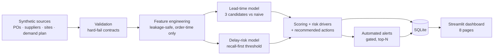

# 🗼 AI Data Center Supply Chain Control Tower

**Automated PO Tracking, Lead-Time Forecasting, and Supply Risk Intelligence**


A production-style decision-support platform for a rapidly scaling AI
infrastructure company: **1,650 purchase orders** across 12 equipment
categories (GPU systems → transformers → chillers), 30 suppliers and 8 data
center sites — with an automated ETL pipeline, two ML models, supplier
scorecards, site readiness scoring, demand-gap analysis and interactive
scenario planning.

**🔗 Live demo:** _add your Streamlit Cloud URL_ ·
**📋 Upgrade audit:** [PROJECT_UPGRADE_AUDIT.md](PROJECT_UPGRADE_AUDIT.md) ·
**📐 Model docs:** [MODEL_DOCUMENTATION.md](MODEL_DOCUMENTATION.md)

<!-- Screenshot: add docs/screenshots/control-tower.png after deploying -->

## The operational questions it answers

What's on order and where is it? Which POs will miss their required-on-site
dates — and *why*? Which suppliers are deteriorating? Which categories put
deployment schedules at risk? Is confirmed supply sufficient for planned
capacity expansion? Where should managers escalate today, and what should
they do about it?

## Platform tour (10 pages)

| Page | What it does |
|---|---|
| **🗼 Control Tower** | Executive KPIs (PO value, at-risk exposure, OTD, readiness), risk mix, live alert feed, one-click AI executive brief |
| **📦 PO Tracking** | Every order: status, ETAs, delay probability, risk score, recommended action — 8 filters, 5 sort strategies, per-PO drill-down with risk drivers |
| **⏱️ Lead-Time Forecasting** | 3 models vs naive baseline (MAE/RMSE/MAPE/R²), permutation importance, predicted-vs-actual, model-vs-commitment gap list |
| **🎯 Delay Risk** | Recall-first classifier (AUC ≈ 0.93), confusion matrix, threshold policy, per-PO plain-English risk drivers |
| **🏭 Supplier Analytics** | 6-dimension scorecards, overall supplier risk score, exposure × performance risk bubble matrix, per-supplier trends |
| **🏗️ Infrastructure Readiness** | Per-site readiness score linking supply state to deployment schedules, critical-path blockers, schedule-impact estimates |
| **📈 Demand Forecast** | Trend forecast with confidence bands, planned demand vs confirmed inbound supply, gap and coverage tables |
| **🧪 Scenario Analysis** | 7 levers (IB lead +30%, transformer capacity −20%, GPU demand +50%, air-freight conversion, second source, buffers…) with before/after risk deltas |
| **📧 Inbox Intelligence** | LLM reads supplier emails → structured risk events → linked to real POs with quantified probability shifts. Rule-based extractor as offline fallback |
| **💬 Ask the Control Tower** | Natural language → sanitized read-only SQL → results + interpretation, with the generated query shown for audit. Prepared question library offline |

## Architecture



One command runs everything (≈6s): data generation → validation → features →
both models → scoring → supplier/site/demand aggregates → SQLite → alerts.

## Quickstart

```bash
git clone <this repo> && cd control-tower
pip install -r requirements.txt
python -m src.pipeline          # build data, train models, load SQLite
streamlit run dashboard/Home.py # (auto-runs the pipeline if you skip step 3)
```

Optional AI narration (executive brief, supplier-call notes):

```bash
export ANTHROPIC_API_KEY=sk-ant-...   # offline deterministic fallback otherwise
```

Verify the build:

```bash
python -m tests.test_pipeline   # 26 causality/model/integrity checks
```

## Modeling highlights (details in MODEL_DOCUMENTATION.md)

- **Beats the plan, not a strawman:** lead-time models are benchmarked against
  the naive "trust the supplier's committed lead time" baseline — MAE ~17d vs
  ~26.5d (−36%).
- **Censoring handled explicitly:** delivered-only data is survivor-biased;
  train/test use a closed-window cohort so models are honestly evaluated.
- **Recall-first risk policy:** threshold tuned so the *worst* CV fold clears
  recall 0.85 — missing a real delay costs more than a false alarm (test
  recall ≈ 0.91 at precision ≈ 0.70).
- **Explainable end-to-end:** every probability carries plain-English drivers
  ("supplier utilization 93%", "no qualified alternative supplier"), every
  composite score has documented weights in `config/settings.py`.

## Where the LLM actually earns its keep

The division of labor is deliberate: **deterministic models own every number;
the LLM owns what models can't do.**

1. **Reading (Inbox Intelligence).** The earliest delay signals live in text —
   *"shipments may slip ~2 weeks"* exists in no database field. The LLM turns
   supplier emails into structured events (`{event_type, impact_days,
   confidence, affected_pos}`), entity-linked to real POs, with quantified
   probability shifts. A regex/rule extractor provides the offline fallback.
2. **Translating (Ask the Control Tower).** Plain-language questions become
   sanitized, read-only SQL (SELECT-only, denylist, row caps, `mode=ro`
   connection) — opening "questions only analysts could ask" to everyone,
   with the generated query always shown for audit.
3. **Narrating (executive brief, supplier-call notes).** Grounded synthesis
   over model outputs — never overriding them.

What the LLM deliberately does *not* do here: tabular prediction. Gradient
boosting beats LLMs on structured data at a fraction of the cost — knowing
where not to use an LLM is part of the design.

## Repository structure

```
control-tower/
├── config/settings.py       # every business constant, causal parameter, weight
├── data/{raw,processed,synthetic}
├── src/
│   ├── data_generation/     # seeded causal generator (1,650 POs)
│   ├── validation/          # contract checks, JSON report, hard fail
│   ├── transformation/      # leakage-safe features + supplier/site aggregates
│   ├── forecasting/         # lead-time models + demand forecast
│   ├── risk_model/          # delay classifier + risk score + drivers
│   ├── recommendations/     # rule-ladder action engine
│   ├── alerts/              # gated, state-derived alert generation
│   ├── llm/                 # optional Claude narration (offline fallback)
│   ├── db.py                # SQLite load/access
│   └── pipeline.py          # one-command orchestrator
├── dashboard/               # Streamlit: Home + 7 pages
├── notebooks/model_development.ipynb   # executed EDA + training notebook
├── tests/test_pipeline.py   # 26-check verification suite
├── PROJECT_UPGRADE_AUDIT.md # what was retained/upgraded from the predecessor
└── MODEL_DOCUMENTATION.md   # targets, features, splits, results, limitations
```

---

**Disclaimer:** all data is synthetically generated (seeded, causally
consistent) for demonstration. Manufacturer names appear for realism only;
quantities, prices, lead times and performance figures are simulated. ·
MIT License
