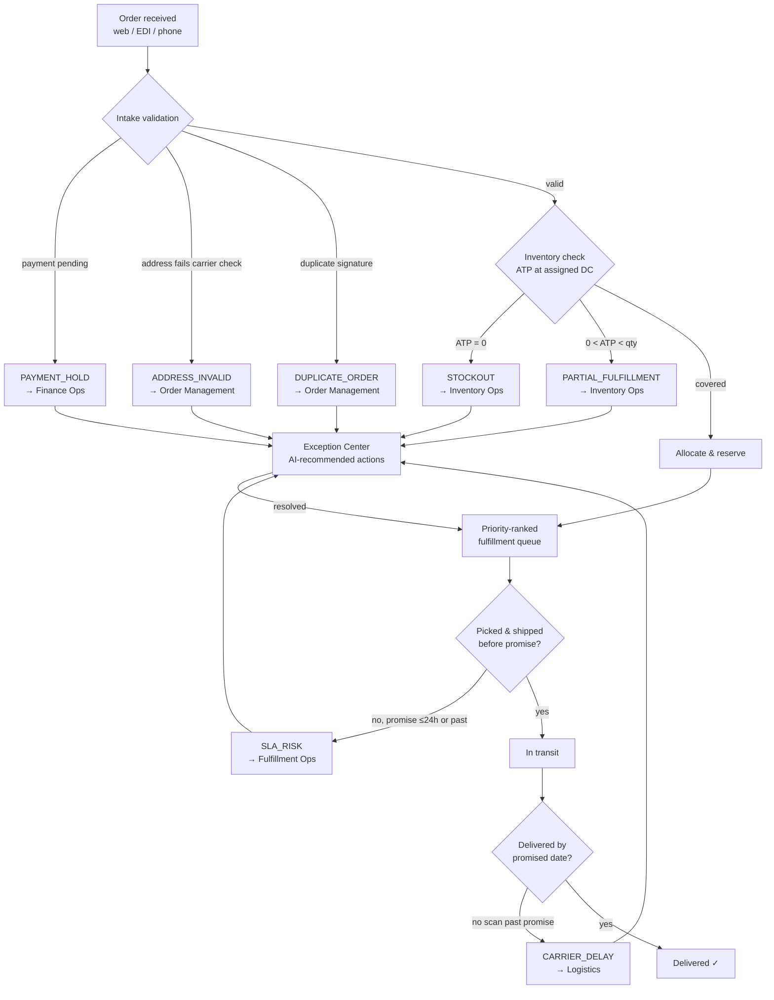
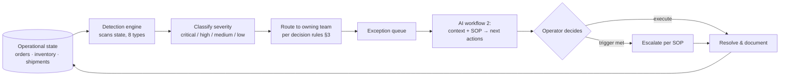
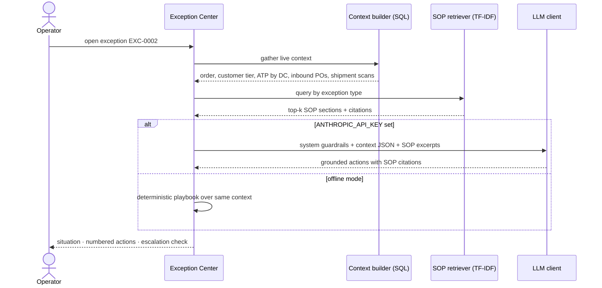
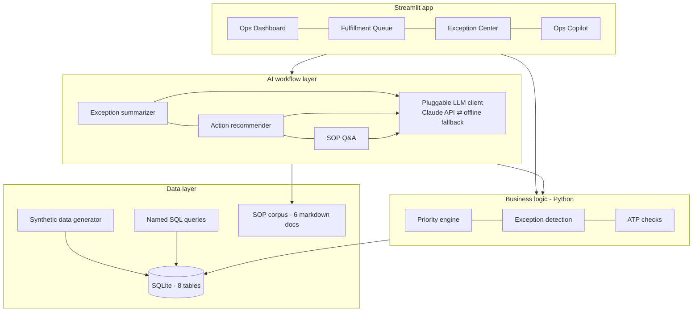

# Workflow Diagrams — OpsPilot

Rendered natively by GitHub (Mermaid). Source of truth for the flows the
prototype implements; decision thresholds live in
[03-decision-rules.md](03-decision-rules.md).

## 1. Order lifecycle (intake → delivery)

## 2. Exception management loop

Key property: detection is **stateless re-derivation** — an exception exists
if and only if the data condition holds. Resolving the underlying state
(inventory arrives, payment clears) removes the condition.

## 3. AI workflow sequence (workflow 2 — recommend actions)

## 4. System architecture

